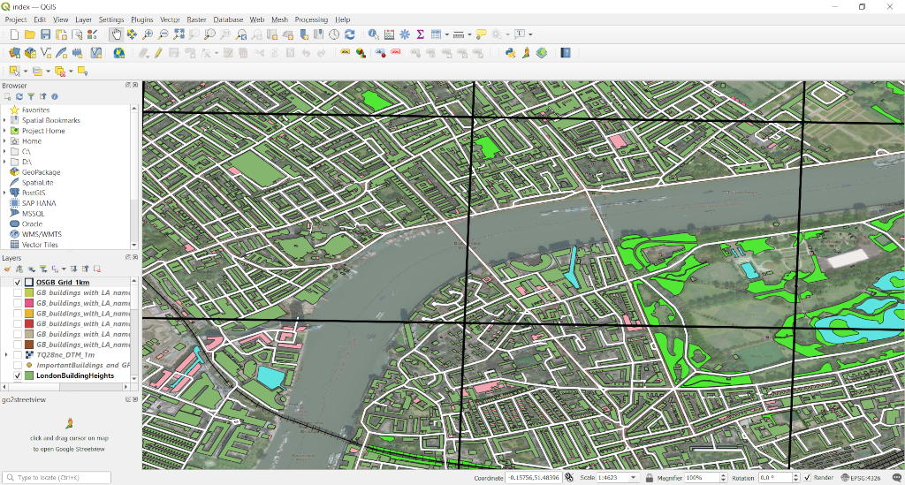

# open_data_uk

This repository list the download links for the Open Data in UK. I utilise the data for my projects.

1. All buildings in Great Britain  
https://automaticknowledge.co.uk/resources/  
https://www.emu-analytics.com/products/datapacks.php

2. Ordnance Survey OpenData  
https://osdatahub.os.uk/downloads/open

3. OS Address (Small Sample Only)  
https://www.ordnancesurvey.co.uk/business-government/products/addressbase

4. Ordance Survey National Grids  
https://github.com/charlesroper/OSGB_Grids

5. Postcode  
https://www.doogal.co.uk/postcodedownloads.php

6. Trees in London  
https://data.london.gov.uk/dataset/local-authority-maintained-trees

7. Lidar, DTM, DSM, Ortho RGB ( Download by Selection)  
https://environment.data.gov.uk/DefraDataDownload/?Mode=survey
